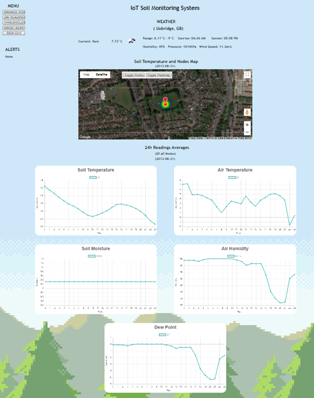
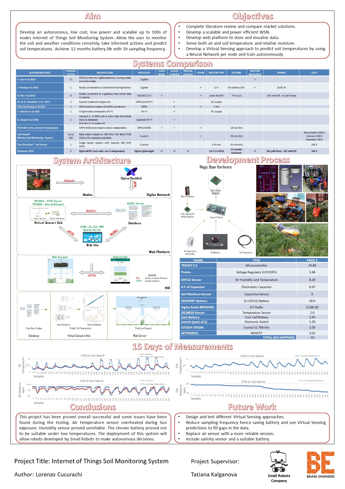

# iotsoilmonitoringsystem
Final Year Dissertation Project

- A power efficient and easy to scale array of sensor nodes for the monitoring of an agricultural field.
- Implemented Neural Network Virtual Sensing approach for forecasting of soil temperatures.
- Achieved 12 months of battery life at 1h samplying frequency.
- Implemented wireless communication and a cloud platform for storage and visualization of the data.
- Implemented a complementary Android application for the visualisation and management of the nodes.
- Bespoke design of sensor nodes, PCB and 3D enclosure.

# News Media Articles

- [Reuters Article (with video)](https://uk.news.yahoo.com/smart-seed-may-help-farmers-171842263.html?guce_referrer=aHR0cHM6Ly93d3cuZ29vZ2xlLmNvbS8&guce_referrer_sig=AQAAAH1baF6Y5CsecRrb4t8-EnJiqmTvUPycbCEKjvVfklYOenoKubs8ZEPpgNuOdm0w1X-qDlqDwxKGH1O03_43cpeoeflLxHOv_1I28qDRgxuiCIOjgyOmAlhD08vY2WVmXYYppWQfcxk6sWgGX8u-dGJLCMurSj0PZlm7rX2w7MaV)

- [Brunel University Article](https://www.brunel.ac.uk/research/projects/internet-of-things-soil-monitoring-system)

## Index Page

## Project Poster

